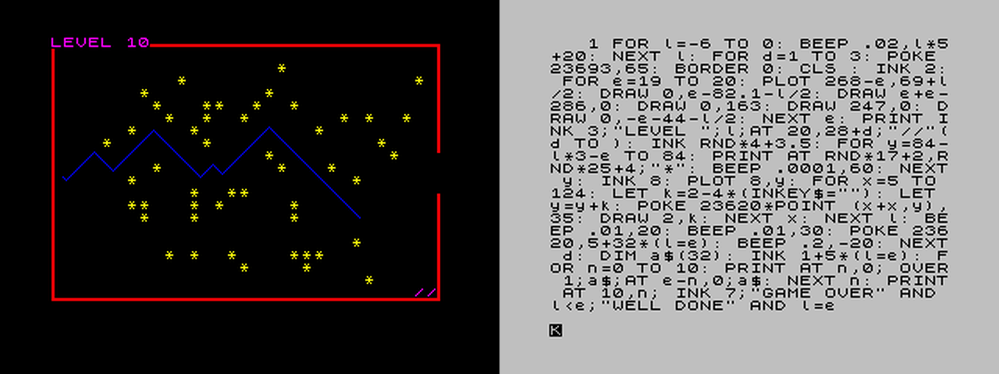

# Line
A one-line arcade game for ZX Spectrum, which fits within a single screen.

https://patters.itch.io/line

> This is extremely enjoyable and probably the best game in the "fun per line of code" category

_f-a, worldofspectrum.org forum_

> What a nice example of simplicity and elegance in both the programming and the design

_IvanBasic, worldofspectrum.org forum_

> Quite frankly a thing of beauty

_Retrospectrum, youtube.com_
